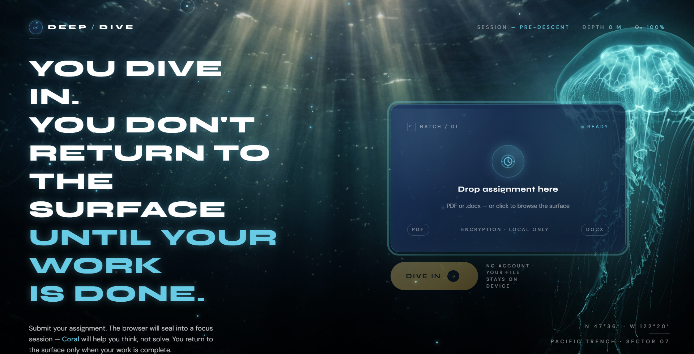

\<div align="center">

# Deep Dive

**You dive in. You don't surface until the work is done.**

An AI-powered study accountability app that locks your browser into an underwater world until your homework is finished — with a bioluminescent jellyfish voice buddy to help you think through the hard parts.

[](https://react.dev)
[](https://vitejs.dev)
[](https://ai.google.dev)
[](https://supabase.com)
[](https://recharts.org)

</div>

---

## What Is It

Deep Dive is a three-phase focus ritual disguised as a deep-sea expedition.

1. **Setup** — paste your assignment, set your intentions, hit *Dive In*.
2. **Lock Screen** — the browser snaps into fullscreen inside an underwater HUD. You can't leave without submitting. Tab switches, pauses, and fullscreen exits are all tracked as "distractions" in real time. A voice-powered AI buddy named **Coral** (a bioluminescent jellyfish) listens and nudges you — she helps you think, not cheat.
3. **Surface Report** — when you submit, Gemini verifies your work and you surface into a full dive report: a performance ring, focus rate, time-away tally, a bucketed focus timeline, and personalized encouragement.

---

## Highlights

- **Fullscreen lock w/ escape tracking** — tab-switches, fullscreen exits, and pauses are timestamped to Supabase so the post-session view can reconstruct exactly when attention drifted.
- **Webcam attention tracking** — a toggleable camera widget uses MediaPipe face detection to catch when you walk off-screen, and Gemini Vision to flag when a phone enters frame. Subtle audio beeps nudge you back if you stay away too long.
- **Voice-first AI buddy (Coral)** — Gemini Live powers a low-latency conversation loop. She asks Socratic questions instead of dropping answers.
- **AI verification gate** — Gemini Flash reviews the submission against the original assignment before the lock releases. No sneaking out with an empty doc.
- **Surface dashboard** — HUD-styled ocean-surface scene with a drifting bioluminescent sea turtle, an animated performance ring, metric tiles for off-camera / phone-spotted events, a time-based focus timeline, AI-generated study insights, and a handwritten-style encouragement from Coral.
- **Cohesive visual language** — three separate screens (Setup / Lock / Surface) but one design DNA: Syne + DM Sans + Fraunces, corner-bracket HUD cards, teal / sand / danger token palette, god-ray ambient lighting.

---

## How It Works

```
1. Paste your assignment         →  Click "Dive In"
2. Browser locks fullscreen      →  Ocean HUD, voice AI, focus timer
3. Flip on the camera (optional) →  Proctor watches for off-screen + phone use
4. Work in the center panel      →  Coral listens and asks questions
5. Click "Surface"               →  Gemini verifies your submission
6. Dashboard surfaces            →  Score, metrics, focus timeline, AI insights
7. "Return to Surface"           →  Back to the landing page for the next dive
```

---

## Screenshots

### Landing



*Paste the assignment, hit* Dive In *— god-rays, a bioluminescent jellyfish, and a HUD telling you how deep you're about to go.*

---

## Tech Stack

| Layer | Technology |
|---|---|
| Frontend | React 18 + Vite 6 |
| Styling | Hand-rolled CSS (tokens + HUD chrome) |
| Charts | Recharts (focus timeline) |
| AI Voice | Gemini Live API (`gemini-2.5-flash-native-audio-preview-12-2025`) |
| AI Text | Gemini Flash (`gemini-flash-latest`) |
| AI Vision | Gemini Flash — phone-in-frame detection |
| Face Detection | MediaPipe Tasks Vision (`blaze_face_short_range`, runs in-browser) |
| Database | Supabase (Postgres + Row-Level Security) |
| Image Assets | nano-banana (Gemini image extension) |
| Hosting | Vercel |

---

## Getting Started

### Prerequisites

- Node.js 18+
- A [Gemini API key](https://ai.google.dev)
- A [Supabase](https://supabase.com) project (optional — the app degrades gracefully without one)

### Installation

```bash
git clone https://github.com/your-username/fullyhacks.git
cd fullyhacks

npm install
cp .env.example .env.local
```

### Environment Variables

```env
VITE_SUPABASE_URL=your_supabase_project_url
VITE_SUPABASE_ANON_KEY=your_supabase_anon_key
GEMINI_API_KEY=your_gemini_api_key
```

`GEMINI_API_KEY` stays server-side. The browser only calls `/api/gemini` (text analysis + phone-vision) and `/api/live-token` (ephemeral Coral voice tokens), so the root Gemini key is never bundled into the client.

### Database Schema

```sql
create table sessions (
  id                uuid primary key default gen_random_uuid(),
  assignment        text not null,
  submission        text,
  started_at        timestamptz default now(),
  ended_at          timestamptz,
  tab_switches      int default 0,
  fullscreen_exits  int default 0,
  pauses            int default 0,
  ai_report         jsonb
);

create table events (
  id          uuid primary key default gen_random_uuid(),
  session_id  uuid references sessions(id) on delete cascade,
  type        text check (type in ('tab_switch','tab_return','fullscreen_exit','pause','resume')),
  timestamp   timestamptz default now()
);
-- Camera-derived events (camera_away / camera_return / phone_detected) are kept
-- local-only to avoid schema churn; they show up in the live dashboard but
-- are not persisted to Supabase.
```

### Run Locally

```bash
npm run dev
```

Open [http://localhost:3000](http://localhost:3000).

---

## Project Structure

```
src/
├── components/
│   ├── setup/          # Phase 1 — landing + assignment input
│   ├── lock/           # Phase 2 — fullscreen ocean HUD + Coral voice + WebcamProctor
│   └── dashboard/      # Phase 3 — surface report
│       ├── SummaryDashboard.jsx   # page shell, animations, turtle ambiance
│       ├── ScoreCard.jsx          # animated performance ring
│       ├── MetricsRow.jsx         # HUD tiles (duration / away / switches / focus / off-camera / phone)
│       ├── FocusTimeline.jsx      # stacked % bar + 30s Recharts buckets
│       └── StudyInsights.jsx      # Gemini-generated post-session coaching
├── hooks/              # useLockScreen, useSession, useEventTracker, useWebcamProctor, useCoral
├── lib/                # supabase.js, gemini.js, liveCoach.js
├── context/            # SessionContext — global session state
└── styles/
    ├── ocean.css       # landing + lock screen — bubble/jellyfish ambiance
    └── dashboard.css   # surface report — HUD cards, turtle, god-rays
public/
└── assets/             # backdrop.png, jellyfish.png, surface-bg.png, turtle.png
```

Full architecture notes, API patterns, and component ownership → [`context.md`](./context.md)

---

## Recent Changes

- **Webcam proctor + phone detection** — new toggleable camera widget on the lock screen. MediaPipe face detection runs locally every 1.5s to catch you stepping away; Gemini Vision is called every 3s (proxied through `/api/gemini`) to detect a phone in frame. Stay away 60s and a gentle beep fires; phone sightings trigger a higher-pitch chirp with a 20s cooldown. Off-camera and phone events are folded into the Focus Timeline and get their own dashboard tiles.
- **AI study insights card** — the surface dashboard now asks Gemini for a personalized post-session breakdown: what you did well, what cost you focus, and one tip for next time. Cached on the session context so it renders once per dive.
- **Surface dashboard rebuild** — Phase 3 now matches the visual DNA of the Setup and Lock screens. Corner-bracket HUD cards, staggered entrance animations, editorial italics hero, and a `surface-bg.png` looking up at the ocean surface with god-rays.
- **Sea turtle ambient asset** — replaced the decorative fish with a bioluminescent teal sea turtle generated via nano-banana. An inverse-luminance SVG filter (`#turtleLuma` in `index.html`) dissolves the white studio backdrop at runtime so the turtle blends into the god-ray scene — same trick the jellyfish uses on the landing page, but mirrored for a light background.
- **Time-based focus math** — the stacked focus bar on the timeline now agrees with the Focus Rate tile. Both sum real elapsed milliseconds per state (focused / paused / distracted) by walking the event log chronologically, instead of counting 30-second buckets.
- **Metrics row slimmed to 4 tiles** — Session Duration, Time Away, Tab Switches, Focus Rate. Fullscreen Exits was folded in.
- **End-of-session reliability** — `endTime` is now set the moment the user hits *Surface*, independent of whether Supabase `finalizeSession` succeeds. Fixes the "—" duration and `0%` focus rate that appeared when Supabase wasn't configured.
- **Single, honest CTA** — the dashboard now ends with one ghost-seafoam pill, *Return to Surface*, that takes you back to the landing page.
- **AI verification error surfacing** — both catch blocks in `lib/gemini.js` log the underlying error so "Verification service unavailable" is diagnosable instead of mysterious.

---

## Design System (tl;dr)

| Token | Role |
|---|---|
| `Syne` | Display — headings, HUD labels, CTA copy |
| `DM Sans` | Body — stats, legend, readouts |
| `Fraunces` (italic) | Editorial moments — "you *surfaced*" |
| `--teal-bright` `#15b4b2` | "Focused" / primary accent |
| `--seafoam` `#48caE4` | HUD chrome, ghost buttons |
| `--sand` `#E9C46A` | "Paused" / gold CTA |
| `#ff7b7b` | "Distracted" / danger |
| Corner brackets | Every card has HUD brackets via `::before` / `::after` |

---

## Contributing

This started as a hackathon project. If you want to hack on it:

1. Read [`context.md`](./context.md) first — it captures architectural decisions and the visual language.
2. Keep the three phases (Setup / Lock / Surface) feeling like one app — same fonts, same tokens, same HUD chrome.
3. Never commit `.env.local`.
4. New ambient assets go through nano-banana (the Gemini CLI extension) for consistency with the existing jellyfish + turtle look.

---

## License

MIT — do whatever you want with it.

---

<div align="center">
Built at a hackathon with the ocean on the brain and too much coffee
</div>
